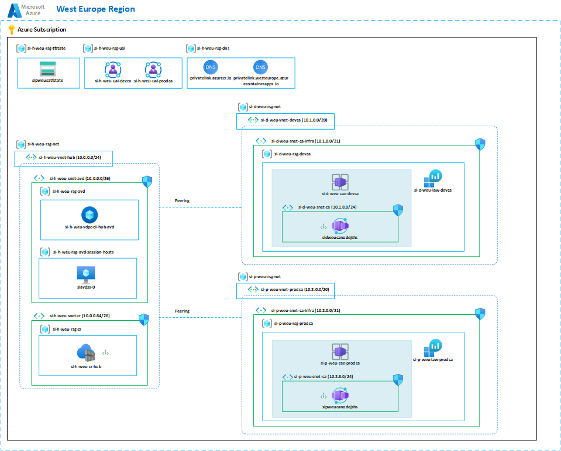

# VFX - Node.js Health Check

This repository contains the infrastructure and application code for a simple Node.js health check application deployed on Azure Container Apps. The infrastructure includes a hub environment with shared resources such as container registry, DNS Private Zones, and an AVD Host Pool to allow private access to the application. See the architecture diagram below.

## Architecture Diagram



## Deployment Steps

Deployments are automated through GitHub Actions workflows.

1. **Hub Infrastructure Deployment** (`.github/workflows/hub.yml`):
   - Triggered on `push` to `main` when changes are made to `infra/environments/westeurope/hub/**`
   - Runs a Terraform/Terragrunt plan for hub resources
   - Applies hub infrastructure changes after manual approval on the `hub` environment

2. **Application Continuous Integration** (`.github/workflows/ci.yml`):
   - Triggered on pull requests to `main`
   - Runs Terraform format checks for modules
   - Validates Terraform modules
   - Builds the Docker image to verify the app build
   - Runs Terragrunt plan for both `dev` and `prod` environments

3. **Application Deployment** (`.github/workflows/cd.yml`):
   - Triggered on `push` to `main`
   - Builds the Docker image and pushes it to Azure Container Registry
   - Deploys the infrastructure and application to the `dev` environment automatically
   - Plans the `prod` environment
   - Deploys to `prod` after manual approval on the `prod` environment

### Prerequisites for CI/CD
- GitHub repository with Azure credentials stored in secrets:
  - `AZURE_CLIENT_ID`
  - `AZURE_TENANT_ID`
  - `AZURE_SUBSCRIPTION_ID`
- Repository or organization variables configured:
  - `ACR_NAME`: Azure Container Registry name
- GitHub OIDC configured for Azure workload identity federation
- Protected GitHub environments with required reviewers:
  - `hub`
  - `prod`

## Environment Strategy

The repository uses a structured Terragrunt environment layout to keep infrastructure modular and consistent:

- `infra/environments/root.hcl`: central remote state and provider configuration for all environments.
- `infra/environments/westeurope/region.hcl`: region-level settings for the West Europe deployment.
- `infra/environments/westeurope/*/env.hcl`: environment-specific variables such as subscription, resource prefixes, and environment names.
- `infra/modules/*`: reusable Terraform modules for resource groups, virtual networks, Container Apps, ACR, log analytics, and more.

### Environments

- **hub**
  - Located in `infra/environments/westeurope/hub`
  - Hosts shared infrastructure used by all application environments
  - Includes Container Registry, Private DNS zones, User Assigned Identity, and AVD host pool for private access
  - Serves as a dependency for `dev` and `prod` deployments to avoid duplicate shared resources

- **dev**
  - Located in `infra/environments/westeurope/dev`
  - Contains an isolated development resource group, virtual network, and Container Apps environment
  - Used for early testing, validation, and CI/CD integration
  - Automatically deployed from the `cd.yml` workflow after successful build and image push

- **prod**
  - Located in `infra/environments/westeurope/prod`
  - Contains production-grade infrastructure with a dedicated resource group, private networking, and zone redundancy
  - Uses the same reusable modules as `dev`, but with production parameters and stricter configuration
  - Deployment is gated behind manual approval in GitHub Actions

### Key strategy points

- Hub resources are shared and provisioned once, while `dev` and `prod` each get their own isolated application infrastructure.
- Common patterns are defined in `infra/modules`, so `dev` and `prod` are structurally consistent while still allowing per-environment overrides.
- The `prod` and `dev` stacks rely on hub outputs for shared services like ACR and DNS, which is managed by Terragrunt dependencies.

## Approvals Implementation

Deployments require approvals at multiple levels:

- **Pull Request Reviews**: All code changes must be reviewed and approved before merging to `main`
- **Hub Environment Approval**: Changes to hub infrastructure require manual approval from designated reviewers in GitHub Actions
- **Production Environment Approval**: Production deployments require manual approval from designated reviewers in GitHub Actions

Approvals ensure that:
- Code quality is maintained
- Infrastructure changes are reviewed for security and compliance
- Production deployments are gated to prevent unauthorized changes

## Accessing the Internal Service

Access to the internal service is provided through the Azure Virtual Desktop (AVD) environment deployed in the Hub. This AVD session is pre-configured with network access to both the `dev` and `prod` application endpoints.

### Access steps

1. Open a browser and navigate to: `https://windows.cloud.microsoft/`
2. Sign in with the provided Entra ID credentials. These were sent over email.
3. Select the `Hub AVD` desktop from the available resources.
4. Once connected, open Microsoft Edge from the desktop.
5. Use the favorites links or browser shortcuts available on the AVD desktop to reach the `dev` or `prod` health endpoint.
6. Verify the service response, for example:
   ```json
   {
     "status": "healthy",
     "environment": "<dev_or_prod>",
     "version": "<image_version_tag>"
   }
   ```
